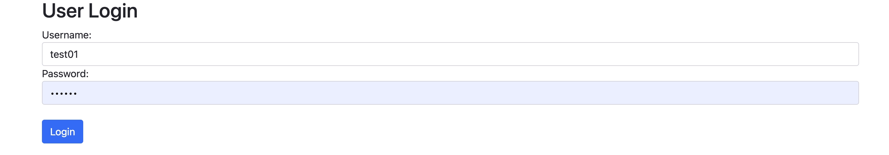
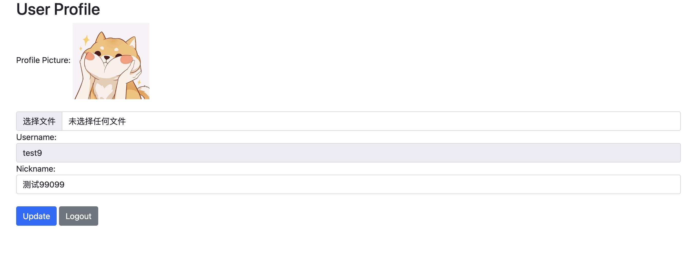

# 项目总结
## 用户登录

## 用户简介

## 1. 基本功能
* 用户可以输入用户名和密码登陆
* 用户可以获取用户简介
* 用户可以修改昵称和头像
* 用户可以登出账号

## 2. 实现RPC框架
* 设计了TCP通信协议，并使用protobuf序列化传输，性能好，效率高。
* 实现了超时处理机制，防止服务挂死。
* 采用反射服务注册，提供便捷的注册接口。
* 设计了RPC Client连接池，减少握手次数。

## 3. 安全方面
* 前后端请求需要时间戳，签名校验，防止中间人攻击
* 通过prepare预编译，防止sql注入
* 密码加salt hmac sha256处理存储在数据库中
* API接口采用token鉴权机制
* token采用uuid随机生成，缓存token和username关系

## 4. 数据库方面
* 采用redis缓存用户数据，减轻访问mysql的压力
* 修改接口延时双删，提高了redis和mysql的数据一致性

## 5. 其他方面
* 设计了日志模块，根据日期生成日志，并有多种日志级别
* 设计了全局错误码，并全局处理panic
* 前后端采用Restful API，用nginx反向代理
* 关键模块编写单元测试
* 优美的前端页面