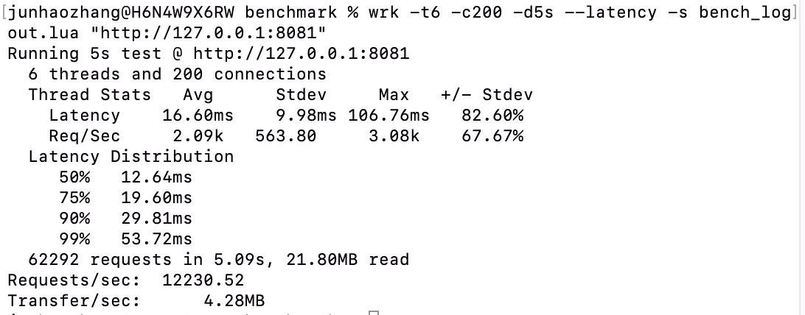

## 压测数据

### /api/login
| client  | QPS     |
|---------| ------- |
| 200固定  | 12026 |
| 200随机  | 7797 |
| 2000固定 | 9953 |
| 2000随机 | 7773 |

#### 200并发(固定用户)

#### 200并发(随机用户)

#### 2000并发(固定用户)

#### 2000并发(随机用户)

### /api/profile

| client  | QPS     |
|---------| ------- |
| 200固定  | 7844 |
| 200随机  | 8140 |
| 2000固定 | 7768 |
| 2000随机 | 8365 |

#### 200并发(固定用户)

#### 200并发(随机用户)

#### 2000并发(固定用户)

#### 2000并发(随机用户)

### /api/updateProfile

| client  | QPS     |
|---------| ------- |
| 200固定  | 7049 |
| 200随机  | 7149 |
| 2000固定 | 4376 |
| 2000随机 | 4850 |

#### 200并发(固定用户)

#### 200并发(随机用户)

#### 2000并发(固定用户)

#### 2000并发(随机用户)

### /api/signout

| client  | QPS     |
|---------| ------- |
| 200固定  | 12230 |
| 200随机  | 13861 |
| 2000固定 | 10143 |
| 2000随机 | 9429 |

#### 200并发(固定用户)

#### 200并发(随机用户)

#### 2000并发(固定用户)

#### 2000并发(随机用户)


### 一些压测命令
```shell
wrk -t6 -c2000 -d5s --latency -s bench_fixed_login.lua "http://127.0.0.1:8081"
wrk -t6 -c200 -d5s --latency -s bench_update.lua "http://127.0.0.1:8081"
wrk -t6 -c200 -d5s --latency -s bench_random_getprofile.lua "http://127.0.0.1:8081"
wrk -t6 -c200 -d5s --latency -s bench_random_login.lua "http://127.0.0.1:8081"
```

### 遇到的问题和解决
#### 1. uuid系统调用延时高


    这个函数延时200ms

#### 2. MySQL报错 "Can't create more than max_prepared_stmt_count statements"
```shell
导致的原因是预编译后，stmt没有关闭。

show variables like '%prepared%'； 查看当前max_prepared_stmt_count的最大值。

错误爆发后，SHOW GLOBAL STATUS LIKE 'com_stmt%'。查看数据库 prepare 的情况。如果Com_stmt_close与Com_stmt_prepare之间的差过大就会报错。

在代码prepare后添加 "defer stmt.Close()"解决。
```

#### 3. MySQL报错 "Too many connections"
```shell
导致的原因是 MySQL的max_connections设置太小。

show variables like '%max_connections%'; 查看数据库最大连接数设置。

set GLOBAL max_connections=1500; 将最大连接设置到合理数值，问题解决。
```
