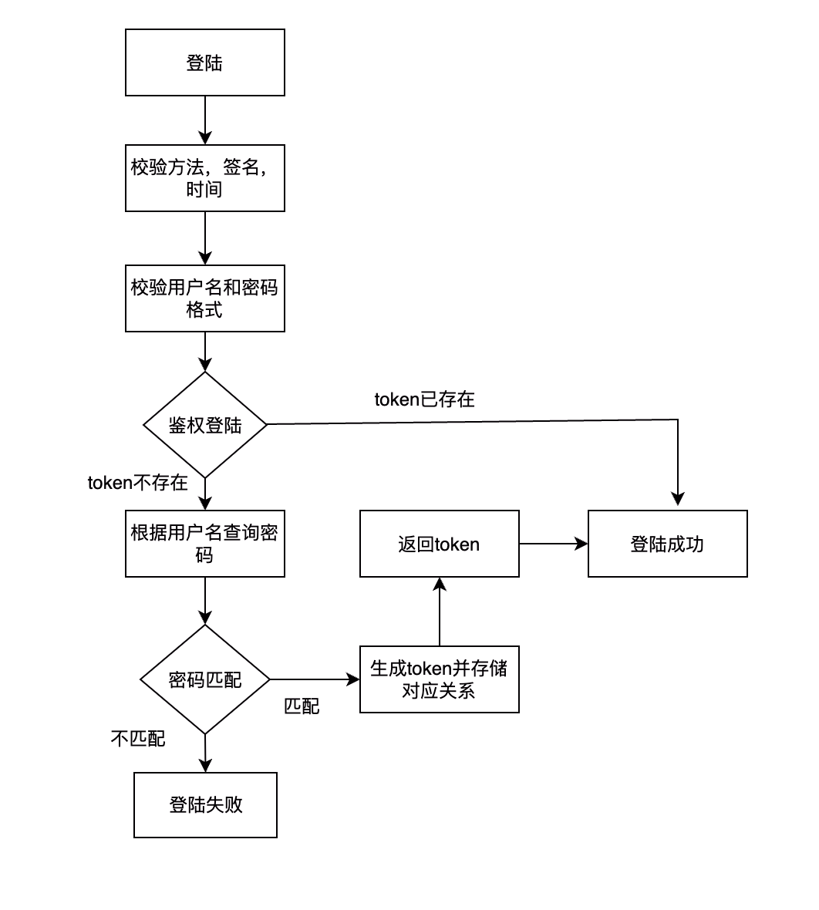
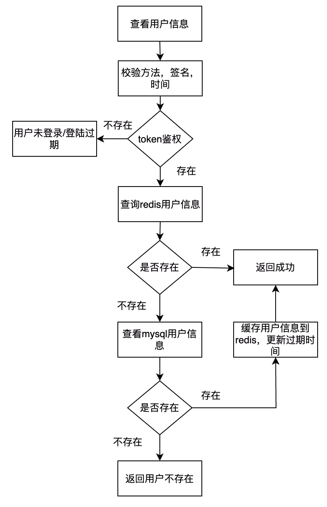
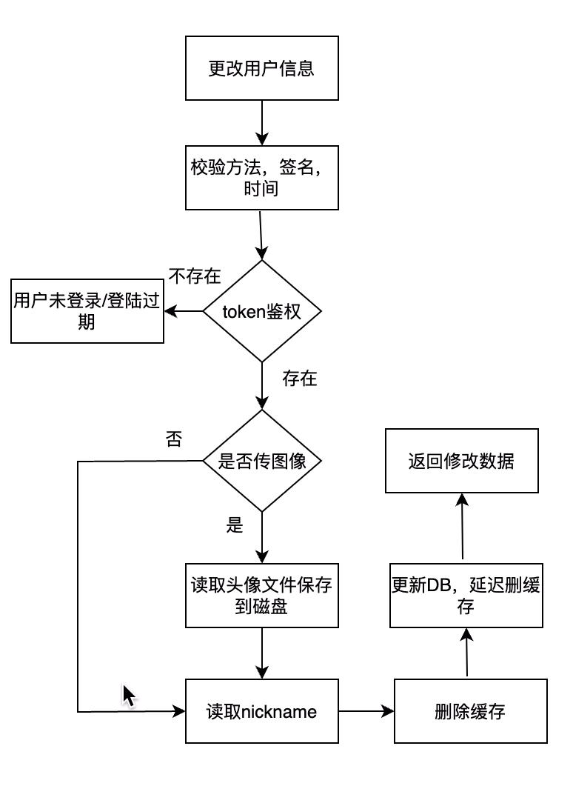

# 系统设计

## 目录结构
```
MyEntryTask
    ├─conf              配置文件，部署脚本   
    ├─docs              文档          
    ├─frontend          前端模块
    ├─httpserver        http服务端
    ├─models            传输协议
    ├─tcpserver         tcp服务端
    ├─utils             公共模块
```
## 系统架构


系统架构主要分六个部分
1. Web浏览器发起请求，可以进行登陆，获取用户信息和修改用户简介操作，发送HTTP请求到nginx。
2. nginx接收到浏览器请求，根据路由规则转发到指定http服务接口执行请求。
3. http服务端接受到请求后，通过rpc客户端向tcp层服务发起请求，待rpc服务端返回响应，
输出到web客户端。
4. tcp服务端负责处理核心逻辑，业务处理，鉴权操作，数据库交互和缓存数据。处理完成将结果返回
给http服务端。http服务端和tcp层交互采用protobuf，提升传输效率。
5. 数据库存储用户信息表，提供更改，查询，插入等接口。缓存存储用户信息和token，用户处理快速
响应和鉴权机制。

## 业务架构


## 核心逻辑
### 用户登陆


### 查看用户信息


### 修改用户信息


## api接口
系统一共对外提供了4个接口，分别是：
1. **用户登录接口**
2. **获取用户接口**
3. **编辑用户接口**
4. **用户登出接口**

其中token存放在header的"Authorization"字段，编辑用户接口图像文件用from-data方式。

### 1. 用户登录接口 /api/login POST
**输入参数**
|    字段名   |类型             |含义 |
|----------------|----------------|--|
|requestID|string           |请求id|
|token|string           |令牌|
|username|string           |用户名|
|password    |string        |密码|

**返回参数**
|   通用字段 | 业务字段  |类型      |含义 |
|---------|-------|----------------|--|
|code | |int           |返回码|
| msg| |string           |返回信息|
|data | |any          | 具体业务数据|
| |token|string           |令牌|

### 2. 获取用户接口 /api/profile GET
**输入参数**
|    字段名   |类型             |含义 |
|----------------|----------------|--|
|requestID|string           |请求id|
|username|string           |用户名|
|token|string           |令牌|

**返回参数**
|   通用字段 | 业务字段  |类型      |含义 |
|---------|-------|----------------|--|
|code | |int           |返回码|
| msg| |string           |返回信息|
|data | |any          | 具体业务数据|
| |username|string           |用户名|
| |nickname|string           |昵称|
| |picfile|string           |图片路径|

### 3. 编辑用户接口 /api/updateProfile POST
**输入参数**
|    字段名   |类型             |含义 |
|----------------|----------------|--|
|requestID|string           |请求id|
|username|string           |用户名|
|token|string           |令牌|
|nickname|string           |昵称|
|PicFile|file           |图像文件|

**返回参数**
|   通用字段 | 业务字段  |类型      |含义 |
|---------|-------|----------------|--|
|code | |int           |返回码|
| msg| |string           |返回信息|
|data | |any          | 具体业务数据|
| |username|string           |用户名|
| |nickname|string           |昵称|
| |picfile|string           |图片路径|

### 4. 用户登出接口 /api/signout POST
**输入参数**
|    字段名   |类型             |含义 |
|----------------|----------------|--|
|requestID|string           |请求id|
|username|string           |用户名|
|token|string           |令牌|

**返回参数**
|   通用字段 | 业务字段  |类型      |含义 |
|---------|-------|----------------|--|
|code | |int           |返回码|
| msg| |string           |返回信息|
|data | |any          | 具体业务数据|